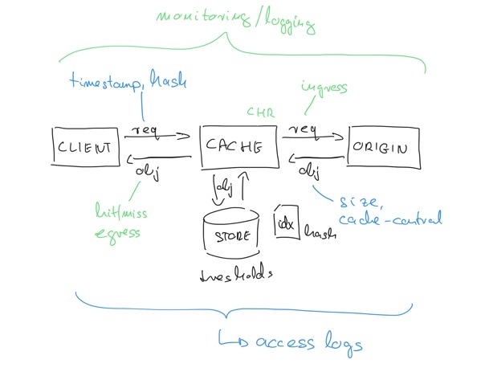
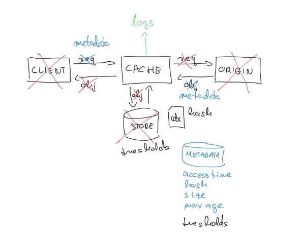
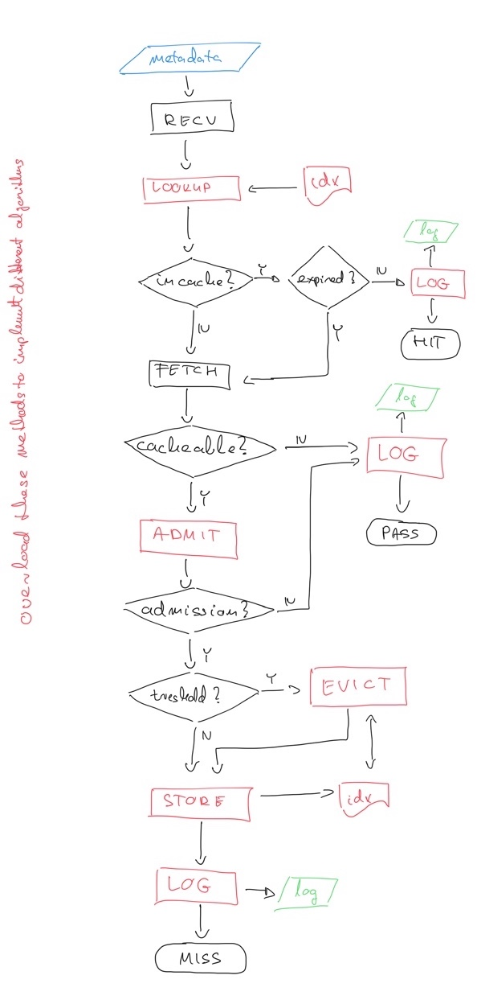

# Cachemodel

## Basic cache model

*Cache* receives requests from a client, checks its local 
store based on an index file. In case of a HIT, object is
sent back to the client, in case of a pass, the object is
fetched from an origin, stored (if needed), and sent back
to the client.

## Simplified cache model
 
To research cache algorithms, the above model can be simplified.

- There is no need to store objects, it is enough to maintain the
  store index to keep track of objects. Bytes of objects can be 
  ignored.
- There is no need to simulate the whole request-response messages
  with the client. It is sufficient, if the already known metadata 
  of the request and response from access logs are sent to the cache.
- The whole origin fetch can be skipped, because the response metadata
  is already know at request time.
  

These simplifications will enable an efficient and performant simulation.
    

## Simulation framework

See the cachesim python modul and the documentation in the source code.

cachesim.Cache provides a basic framework to implement further caching
methods. This class realizes the following message flow:

- The request (and response) metadata is sent to the *recv* method.
- The *lookup* method searches the requested object in the store 
  index table.
    - In case of a match, object's metadata is received, and TTL is checked.
        - If object is not expired, a HIT is logged,
        - else the *fetch* method is triggered.
    - For non-match, the *fetch* method is invoked.
- *fetch* will not fetch the object from the origin, it will only
  make all response related metadata available. Consider, that till this point,
  response related information (size of the object, content type) cannot be
  possible known.
- If content is not cacheable, log PASS.
- If content is cacheable, run the *admit* method.
    - If object is not admitted to the cache, log PASS,
    - else invoke the *store* method.
- The *store* method must maintain the store index table, but must 
  not store the object itself.
- Finally, log a MISS.
    
    
    